# Echoly — Master Architectural & Design Documentation

This document contains a comprehensive set of UML, Behavioral, and Architectural diagrams representing the Echoly system in its entirety.

---

## 1. Structural Diagrams

### 1.1 Class Diagram
Describes the static structure showing classes, attributes, operations, and relationships.

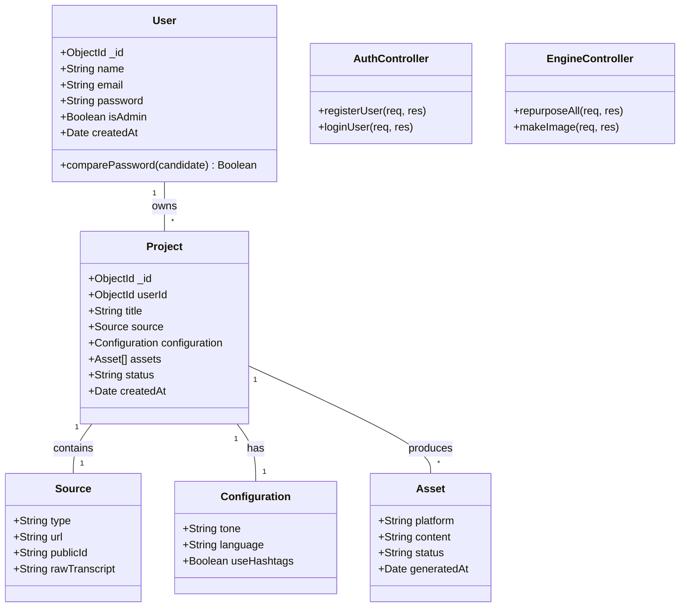
```mermaid
classDiagram
    class User {
        +ObjectId _id
        +String name
        +String email
        +String password
        +Boolean isAdmin
        +Date createdAt
        +comparePassword(candidate) Boolean
    }

    class Project {
        +ObjectId _id
        +ObjectId userId
        +String title
        +Source source
        +Configuration configuration
        +Asset[] assets
        +String status
        +Date createdAt
    }

    class Source {
        +String type
        +String url
        +String publicId
        +String rawTranscript
    }

    class Configuration {
        +String tone
        +String language
        +Boolean useHashtags
    }

    class Asset {
        +String platform
        +String content
        +String status
        +Date generatedAt
    }

    class AuthController {
        +registerUser(req, res)
        +loginUser(req, res)
    }

    class EngineController {
        +repurposeAll(req, res)
        +makeImage(req, res)
    }

    Project "1" -- "1" Source : contains
    Project "1" -- "1" Configuration : has
    Project "1" -- "*" Asset : produces
    User "1" -- "*" Project : owns
```

### 1.2 Component Diagram
Shows how the system is divided into physical components and their dependencies.

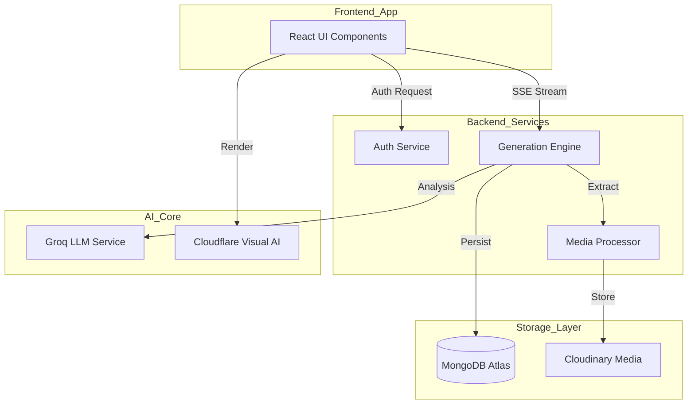
```mermaid
flowchart TB
    subgraph Frontend_App
        A[React UI Components]
    end
    subgraph Backend_Services
        B[Auth Service]
        C[Generation Engine]
        D[Media Processor]
    end
    subgraph Storage_Layer
        E[(MongoDB Atlas)]
        G[Cloudinary Media]
    end
    subgraph AI_Core
        F[Groq LLM Service]
        H[Cloudflare Visual AI]
    end

    A -- "Auth Request" --> B
    A -- "SSE Stream" --> C
    C -- "Analysis" --> F
    C -- "Extract" --> D
    D -- "Store" --> G
    C -- "Persist" --> E
    A -- "Render" --> H
```

### 1.3 Deployment Diagram
Illustrates the physical deployment of artifacts on nodes.

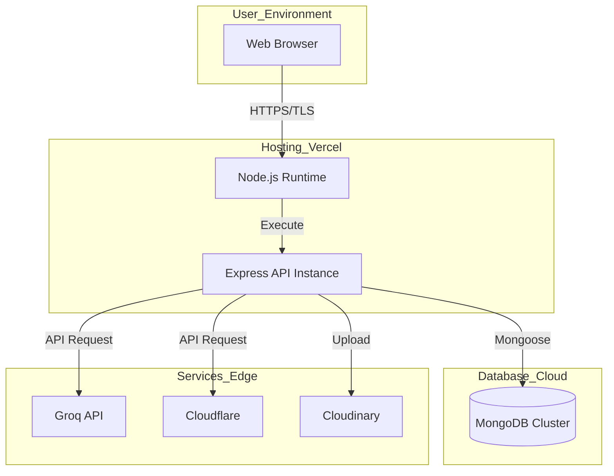
```mermaid
flowchart TB
    subgraph User_Environment
        B[Web Browser]
    end
    subgraph Hosting_Vercel
        S[Node.js Runtime]
        A[Express API Instance]
    end
    subgraph Database_Cloud
        M[(MongoDB Cluster)]
    end
    subgraph Services_Edge
        G[Groq API]
        C[Cloudflare]
        D[Cloudinary]
    end

    B -- "HTTPS/TLS" --> S
    S -- "Execute" --> A
    A -- "Mongoose" --> M
    A -- "API Request" --> G
    A -- "API Request" --> C
    A -- "Upload" --> D
```

### 1.4 Object Diagram
A snapshot of instances and their relationships at a specific point in time.

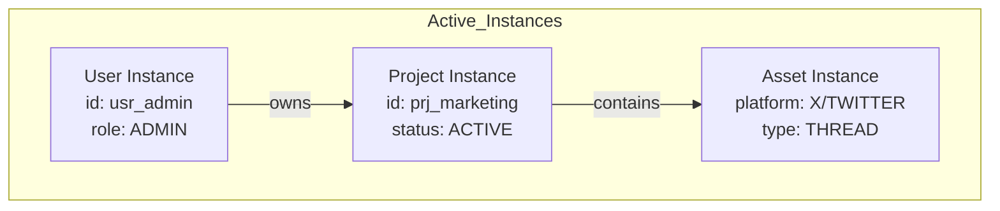
```mermaid
flowchart LR
    subgraph Active_Instances
        direction LR
        U1["User Instance<br/>id: usr_admin<br/>role: ADMIN"]
        P1["Project Instance<br/>id: prj_marketing<br/>status: ACTIVE"]
        A1["Asset Instance<br/>platform: X/TWITTER<br/>type: THREAD"]
    end
    U1 -- "owns" --> P1
    P1 -- "contains" --> A1
```

### 1.5 Package Diagram
Organizes system elements into packages and shows dependencies.

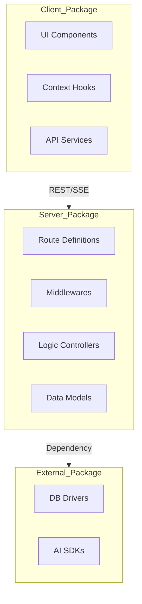
```mermaid
flowchart TB
    subgraph Client_Package
        C1[UI Components]
        C2[Context Hooks]
        C3[API Services]
    end
    subgraph Server_Package
        S1[Route Definitions]
        S2[Middlewares]
        S3[Logic Controllers]
        S4[Data Models]
    end
    subgraph External_Package
        E1[DB Drivers]
        E2[AI SDKs]
    end

    Client_Package -- "REST/SSE" --> Server_Package
    Server_Package -- "Dependency" --> External_Package
```

### 1.6 Composite Structure Diagram
Shows the internal structure of the AI Engine component and its ports.

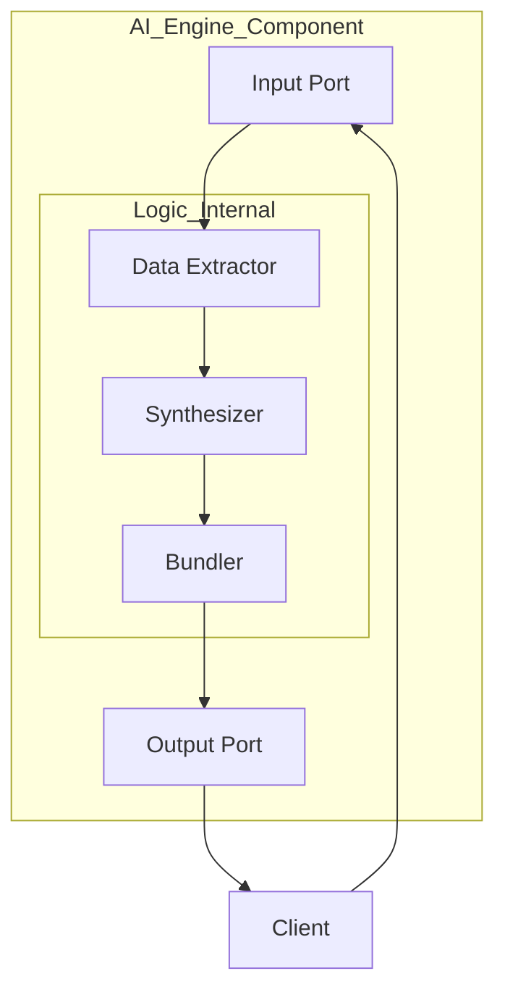
```mermaid
flowchart TB
    subgraph AI_Engine_Component
        InputPort[Input Port]
        OutputPort[Output Port]
        subgraph Logic_Internal
            D[Data Extractor]
            S[Synthesizer]
            B[Bundler]
        end
    end
    Client --> InputPort
    InputPort --> D
    D --> S
    S --> B
    B --> OutputPort
    OutputPort --> Client
```

### 1.7 Profile Diagram
Illustrates extensions of UML elements for AI-specific stereotypes.

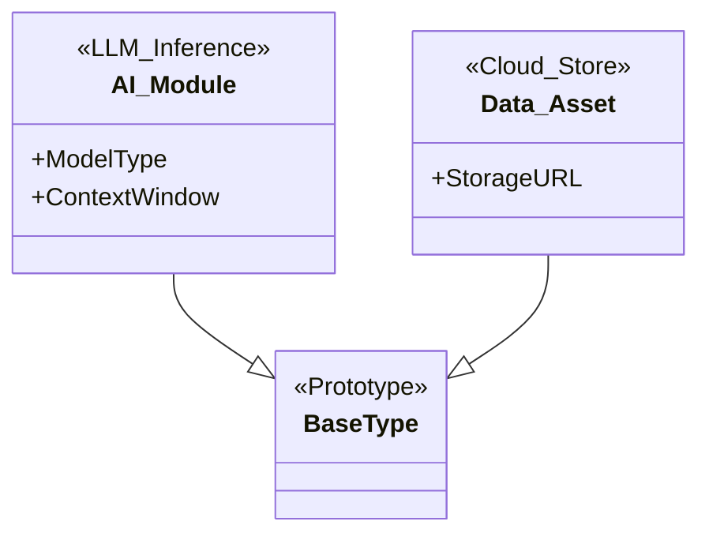
```mermaid
classDiagram
    class BaseType {
        <<Prototype>>
    }
    class AI_Module {
        <<LLM_Inference>>
        +ModelType
        +ContextWindow
    }
    class Data_Asset {
        <<Cloud_Store>>
        +StorageURL
    }
    AI_Module --|> BaseType
    Data_Asset --|> BaseType
```

---

## 2. Behavioral Diagrams

### 2.1 Use Case Diagram
Functional requirements from the perspective of user roles.

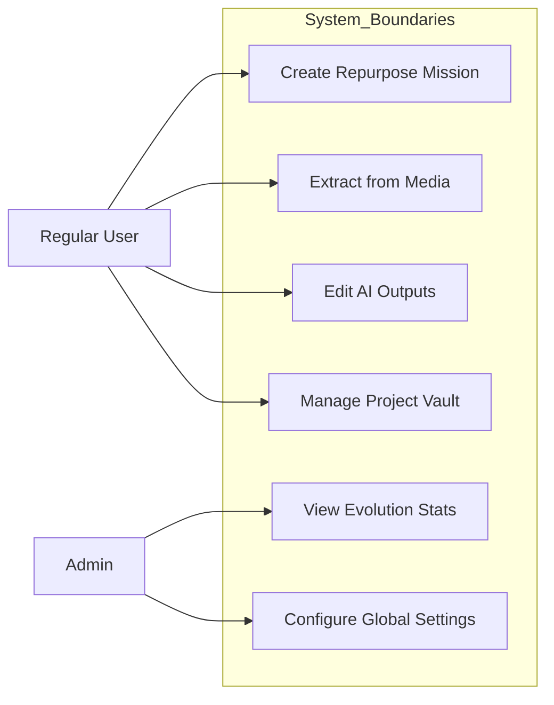
```mermaid
flowchart LR
    User[Regular User]
    Admin[Admin]

    subgraph System_Boundaries
        direction TB
        UC1[Create Repurpose Mission]
        UC2[Extract from Media]
        UC3[View Evolution Stats]
        UC4[Edit AI Outputs]
        UC5[Manage Project Vault]
        UC6[Configure Global Settings]
    end

    User --> UC1
    User --> UC2
    User --> UC4
    User --> UC5
    Admin --> UC3
    Admin --> UC6
```

### 2.2 Activity Diagram
The step-by-step workflow of a generation mission.

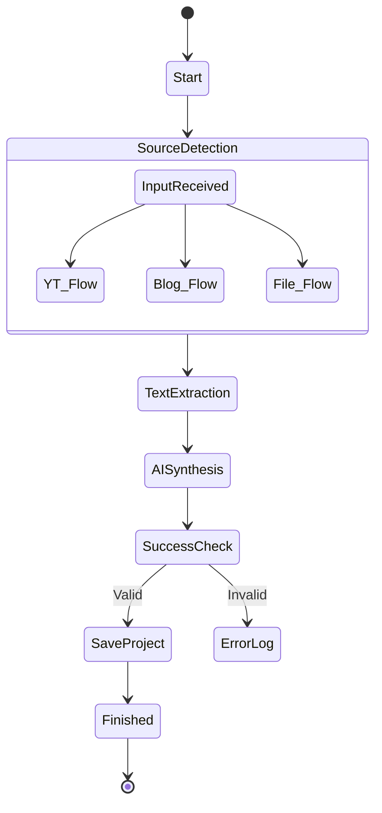
```mermaid
stateDiagram-v2
    [*] --> Start
    Start --> SourceDetection
    state SourceDetection {
        InputReceived --> YT_Flow
        InputReceived --> Blog_Flow
        InputReceived --> File_Flow
    }
    SourceDetection --> TextExtraction
    TextExtraction --> AISynthesis
    AISynthesis --> SuccessCheck
    SuccessCheck --> SaveProject : Valid
    SuccessCheck --> ErrorLog : Invalid
    SaveProject --> Finished
    Finished --> [*]
```

### 2.3 Sequence Diagram
Timed interaction between objects for the main generation flow.

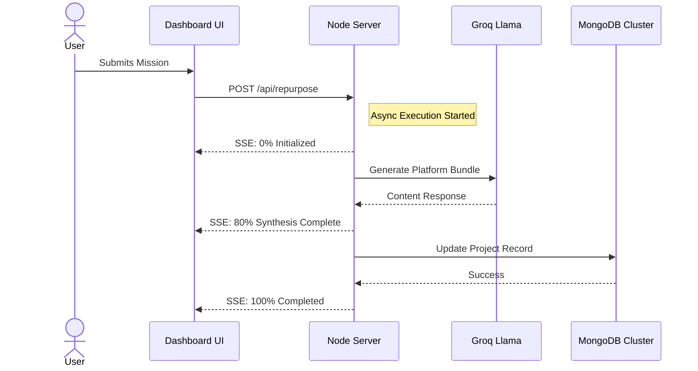
```mermaid
sequenceDiagram
    actor User
    participant App as Dashboard UI
    participant Svr as Node Server
    participant AI as Groq Llama
    participant DB as MongoDB Cluster

    User->>App: Submits Mission
    App->>Svr: POST /api/repurpose
    Note right of Svr: Async Execution Started
    Svr-->>App: SSE: 0% Initialized
    Svr->>AI: Generate Platform Bundle
    AI-->>Svr: Content Response
    Svr-->>App: SSE: 80% Synthesis Complete
    Svr->>DB: Update Project Record
    DB-->>Svr: Success
    Svr-->>App: SSE: 100% Completed
```

### 2.4 State Machine Diagram
Tracks the lifecycle of a Project document.

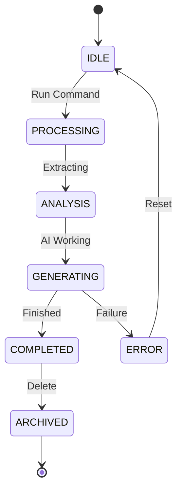
```mermaid
stateDiagram-v2
    [*] --> IDLE
    IDLE --> PROCESSING : Run Command
    PROCESSING --> ANALYSIS : Extracting
    ANALYSIS --> GENERATING : AI Working
    GENERATING --> COMPLETED : Finished
    GENERATING --> ERROR : Failure
    ERROR --> IDLE : Reset
    COMPLETED --> ARCHIVED : Delete
    ARCHIVED --> [*]
```

### 2.5 Communication Diagram
Focuses on object relationships and message exchange.

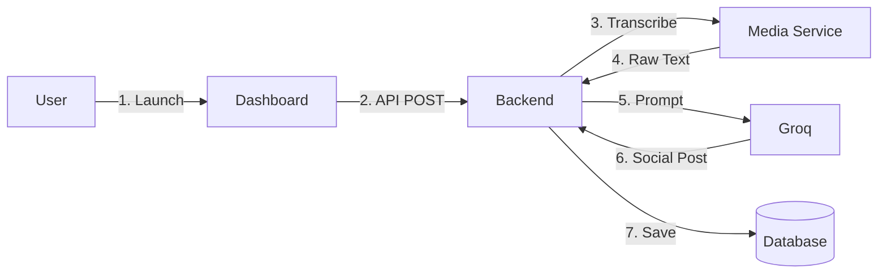
```mermaid
flowchart LR
    U[User] -- "1. Launch" --> UI[Dashboard]
    UI -- "2. API POST" --> BE[Backend]
    BE -- "3. Transcribe" --> MS[Media Service]
    MS -- "4. Raw Text" --> BE
    BE -- "5. Prompt" --> AI[Groq]
    AI -- "6. Social Post" --> BE
    BE -- "7. Save" --> DB[(Database)]
```

### 2.6 Interaction Overview Diagram
Combines activity and sequence elements for control logic.

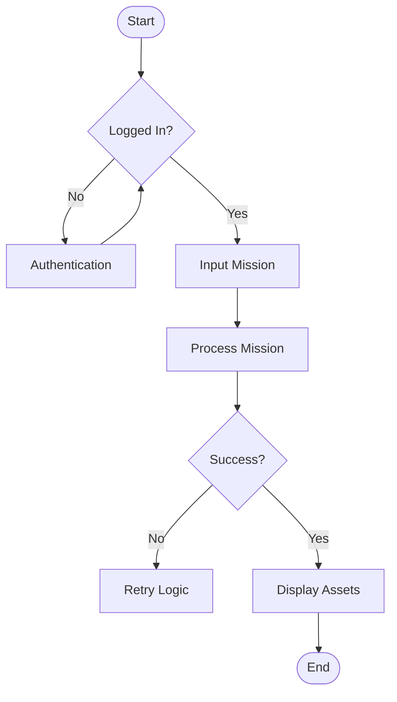
```mermaid
flowchart TD
    S([Start]) --> AuthCheck{Logged In?}
    AuthCheck -- No --> AuthFlow[Authentication]
    AuthCheck -- Yes --> MissionInput[Input Mission]
    MissionInput --> CoreProcess[Process Mission]
    CoreProcess --> StatusCheck{Success?}
    StatusCheck -- No --> RetryFlow[Retry Logic]
    StatusCheck -- Yes --> ResultView[Display Assets]
    ResultView --> E([End])
    AuthFlow --> AuthCheck
```

### 2.7 Timing Diagram
Visualizes state benchmarks over a generation window.

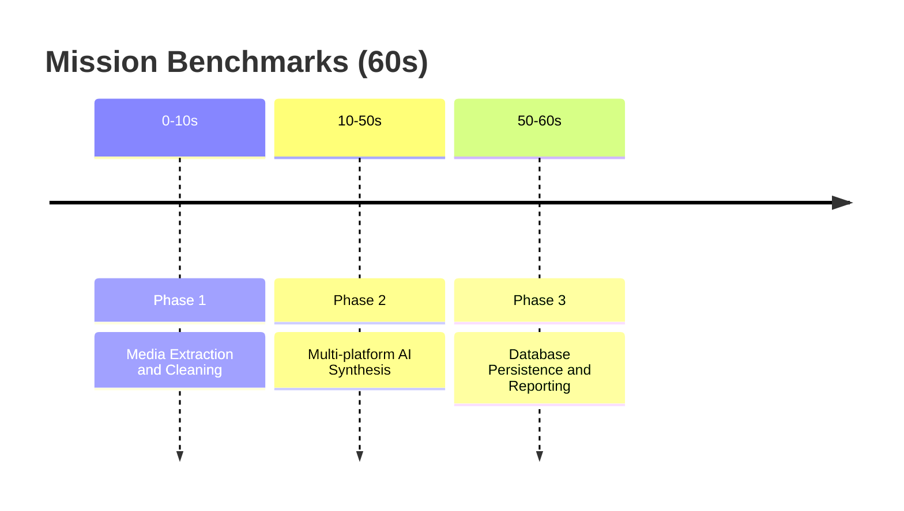
```mermaid
timeline
    title Mission Benchmarks (60s)
    0-10s : Phase 1 : Media Extraction and Cleaning
    10-50s : Phase 2 : Multi-platform AI Synthesis
    50-60s : Phase 3 : Database Persistence and Reporting
```

---

## 3. Architectural & Data Diagrams

### 3.1 Entity Relationship Diagram (ERD)
Logical data model for the application.

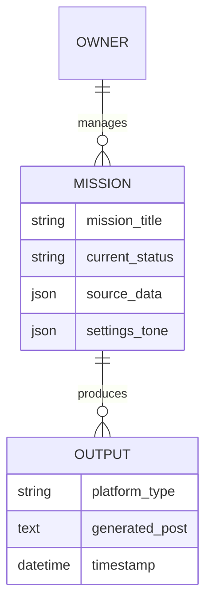
```mermaid
erDiagram
    OWNER ||--o{ MISSION : manages
    MISSION ||--o{ OUTPUT : produces
    MISSION {
        string mission_title
        string current_status
        json source_data
        json settings_tone
    }
    OUTPUT {
        string platform_type
        text generated_post
        datetime timestamp
    }
```

### 3.2 Data Flow Diagram (DFD) — Level 1
Data movements through internal processes.

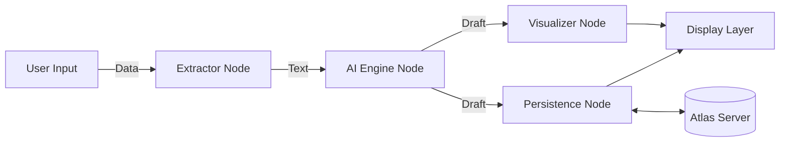
```mermaid
flowchart LR
    RawInput[User Input] -->|Data| P1[Extractor Node]
    P1 -->|Text| P2[AI Engine Node]
    P2 -->|Draft| P3[Visualizer Node]
    P2 -->|Draft| P4[Persistence Node]
    P4 <--> DB[(Atlas Server)]
    P3 --> UI[Display Layer]
    P4 --> UI
```

### 3.3 System Context Diagram
High-level system abstraction.

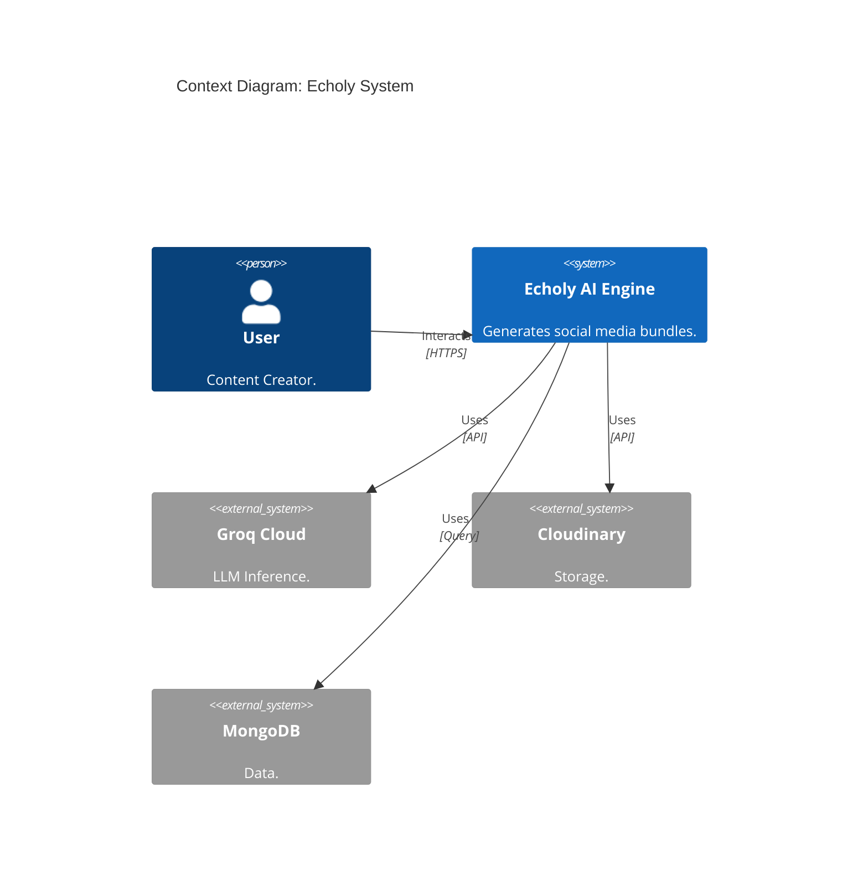
```mermaid
C4Context
    title Context Diagram: Echoly System
    
    Person(user, "User", "Content Creator.")
    System(echoly, "Echoly AI Engine", "Generates social media bundles.")
    
    System_Ext(groq, "Groq Cloud", "LLM Inference.")
    System_Ext(cloudinary, "Cloudinary", "Storage.")
    System_Ext(mongo, "MongoDB", "Data.")

    Rel(user, echoly, "Interacts", "HTTPS")
    Rel(echoly, groq, "Uses", "API")
    Rel(echoly, cloudinary, "Uses", "API")
    Rel(echoly, mongo, "Uses", "Query")
```

### 3.4 C4 Container Diagram
Technical containers in the system.

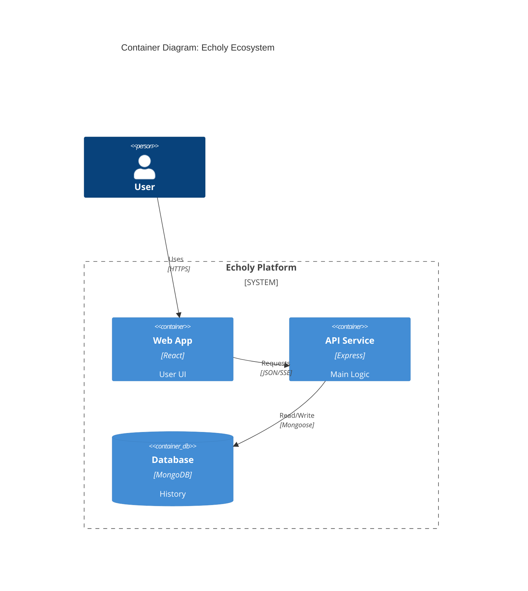
```mermaid
C4Container
    title Container Diagram: Echoly Ecosystem
    
    Person(p, "User")
    
    System_Boundary(b, "Echoly Platform") {
        Container(app, "Web App", "React", "User UI")
        Container(api, "API Service", "Express", "Main Logic")
        ContainerDb(db, "Database", "MongoDB", "History")
    }
    
    Rel(p, app, "Uses", "HTTPS")
    Rel(app, api, "Requests", "JSON/SSE")
    Rel(api, db, "Read/Write", "Mongoose")
```

### 3.5 C4 Component Diagram
Components within the API container.

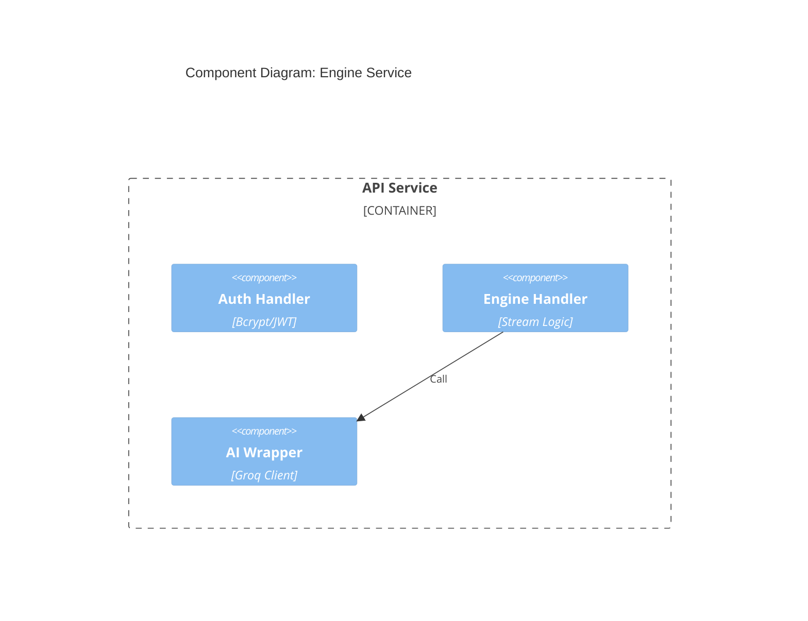
```mermaid
C4Component
    title Component Diagram: Engine Service
    
    Container_Boundary(api, "API Service") {
        Component(auth, "Auth Handler", "Bcrypt/JWT")
        Component(gen, "Engine Handler", "Stream Logic")
        Component(svc, "AI Wrapper", "Groq Client")
    }
    
    Rel(gen, svc, "Call")
```

### 3.6 Level 0 Context Flowchart
Highest level flowchart logic.

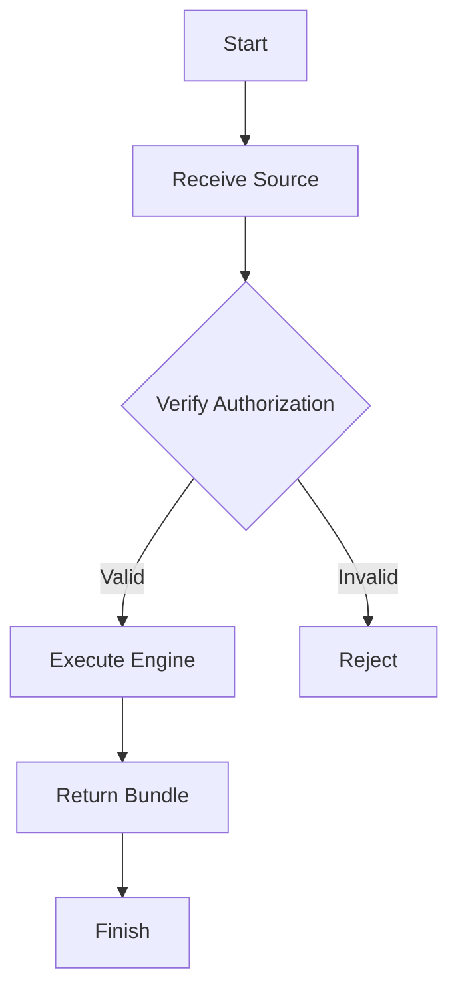
```mermaid
flowchart TD
    A[Start] --> B[Receive Source]
    B --> C{Verify Authorization}
    C -- Valid --> D[Execute Engine]
    C -- Invalid --> E[Reject]
    D --> F[Return Bundle]
    F --> G[Finish]
```

---
*Documentation dossier generated for Echoly v1.0 — Architecture Team*
