# Echoly — Master Architectural & Design Documentation

This document contains a comprehensive set of UML, Behavioral, and Architectural diagrams representing the Echoly system in its entirety.

---

## 🏗️ 1. Structural Diagrams

### 1.1 Class Diagram
Describes the static structure showing classes, attributes, operations, and relationships.

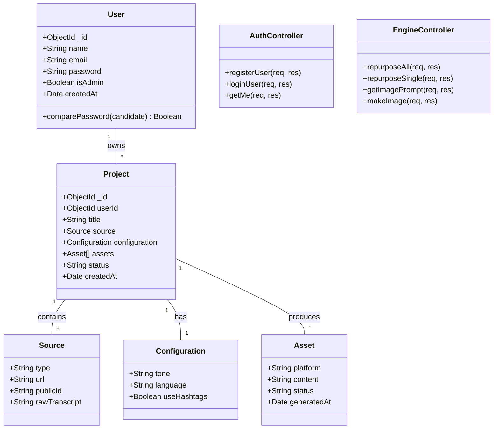

### 1.2 Component Diagram
Shows how the system is divided into physical components and their dependencies.

```mermaid
componentDiagram
    component [Frontend App (React)] as FE
    component [Auth Service] as Auth
    component [Generation Engine] as Engine
    component [Media Processor] as Media
    component [Database (MongoDB)] as DB
    component [Groq API] as AI
    component [Cloudinary] as CDN
    component [Cloudflare AI] as Visual

    FE ..> Auth : JWT Request
    FE ..> Engine : SSE Request
    Engine ..> Media : Extract Content
    Engine ..> AI : Llama 3.1
    Engine ..> DB : Persist Project
    Media ..> CDN : Upload
    FE ..> Visual : Image Gen
```

### 1.3 Deployment Diagram
Illustrates the physical deployment of artifacts on nodes.

```mermaid
deploymentDiagram
    node "User Browser" {
        artifact "React SPA"
    }
    node "Vercel / Hosting" {
        node "Server Container" {
            artifact "Node.js Express API"
        }
    }
    node "MongoDB Atlas Cluster" {
        database "Echoly_DB"
    }
    node "Third Party Edge" {
        node "Groq Inference"
        node "Cloudflare Workers AI"
        node "Cloudinary"
    }

    "React SPA" -- "HTTPS/WSS" : "Node.js Express API"
    "Node.js Express API" -- "Mongoose" : "Echoly_DB"
```

### 1.4 Object Diagram
A snapshot of instances and their relationships at a specific point in time.

```mermaid
objectDiagram
    object "UserInstance : User" as U1 {
        id: "usr_101"
        name: "Admin"
    }
    object "ProjectInstance : Project" as P1 {
        id: "prj_202"
        title: "Q3 Marketing"
        status: "COMPLETED"
    }
    object "LinkedinAsset : Asset" as A1 {
        platform: "LINKEDIN"
        content: "Thrilled to share..."
    }

    U1 .. P1 : owns
    P1 .. A1 : contains
```

### 1.5 Package Diagram
Organizes system elements into packages and shows dependencies.

```mermaid
packageDiagram
    package "Client-Side" {
        [Components]
        [Hooks]
        [Services]
    }
    package "Server-Side" {
        [Routes]
        [Controllers]
        [Middleware]
        [Services]
        [Models]
    }
    package "External-Infrastructure" {
        [Database]
        [AI-Providers]
    }

    "Client-Side" ..> "Server-Side" : REST / SSE
    "Server-Side" ..> "External-Infrastructure" : API Calls
```

### 1.6 Composite Structure Diagram
Shows the internal structure of the AI Engine component and its ports.

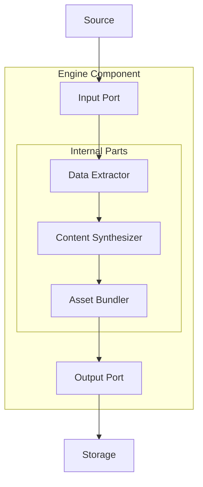

### 1.7 Profile Diagram
Illustrates extensions of UML elements for AI-specific stereotypes.

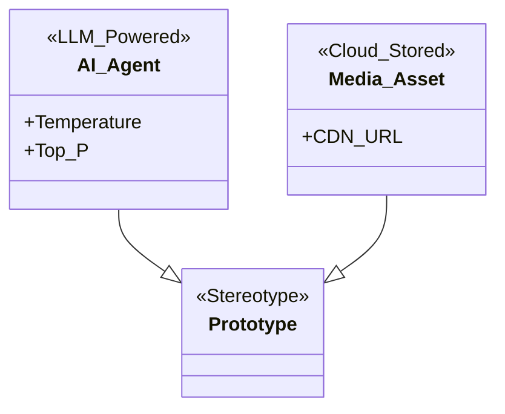

---

## 🎬 2. Behavioral Diagrams

### 2.1 Use Case Diagram
Functional requirements from the perspective of user roles.

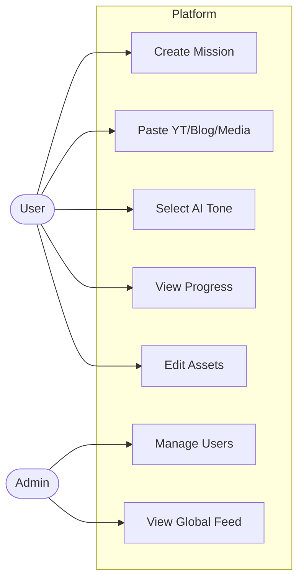

### 2.2 Activity Diagram
The step-by-step workflow of a generation mission.

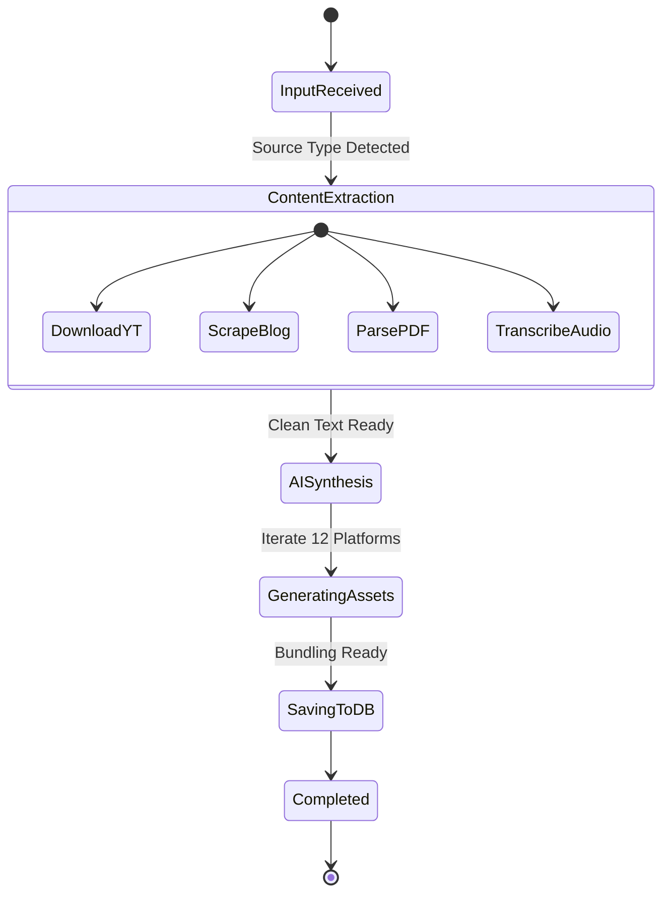

### 2.3 Sequence Diagram
Timed interaction between objects for the "Repurpose All" flow.

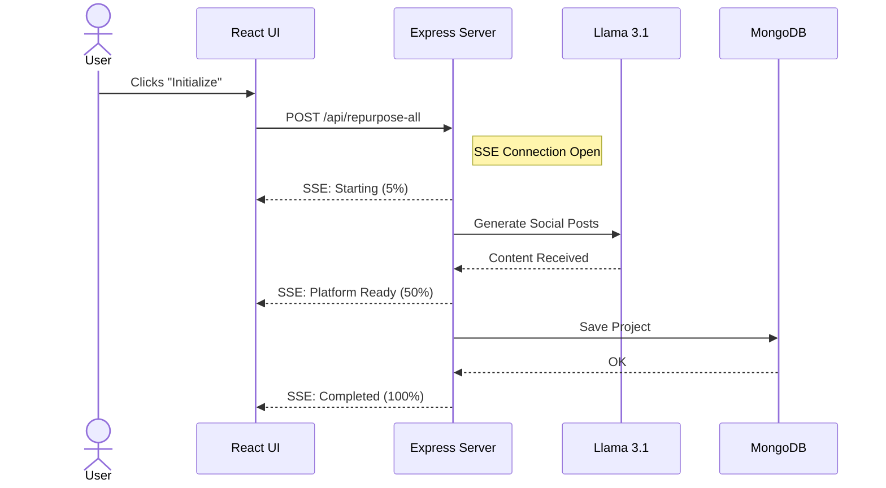

### 2.4 State Machine Diagram
Tracks the lifecycle of a Project document.

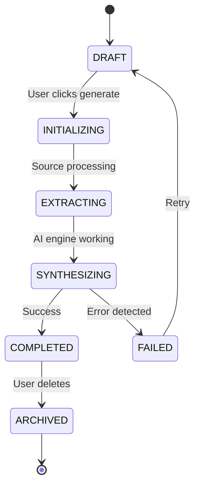

### 2.5 Communication Diagram
Focuses on object relationships and message exchange.

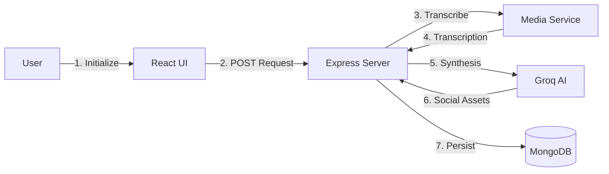

### 2.6 Interaction Overview Diagram
Combines activity and sequence elements for high-level control.

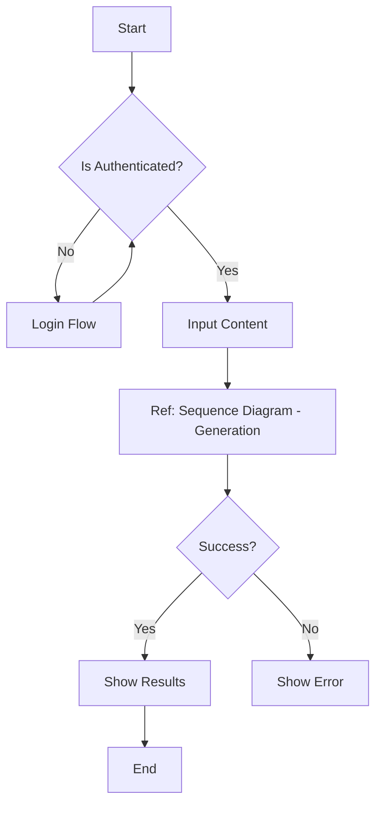

### 2.7 Timing Diagram
Visualizes state changes over a time window.

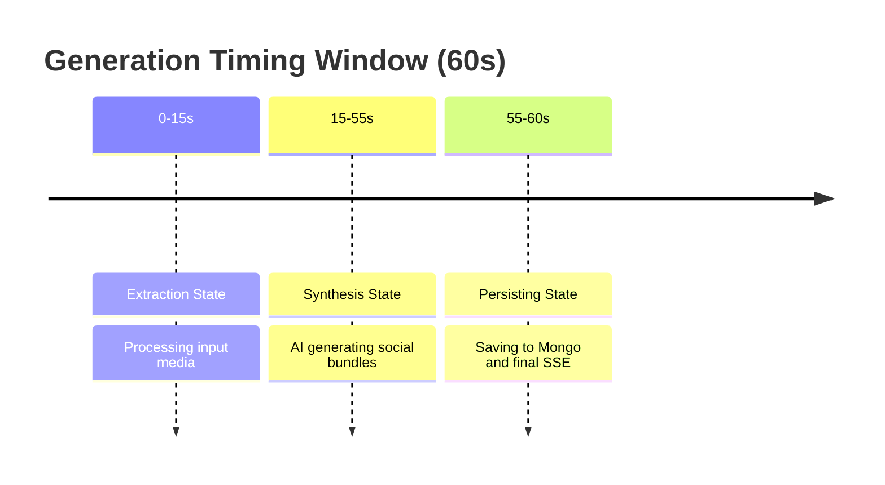

---

## 🗺️ 3. Architectural & Data Diagrams

### 3.1 Entity Relationship Diagram (ERD)
Logical data model for the application.

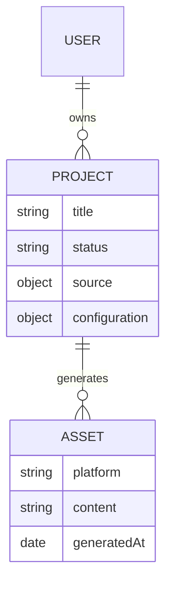

### 3.2 Data Flow Diagram (DFD) — Level 1
Data movements through internal processes.

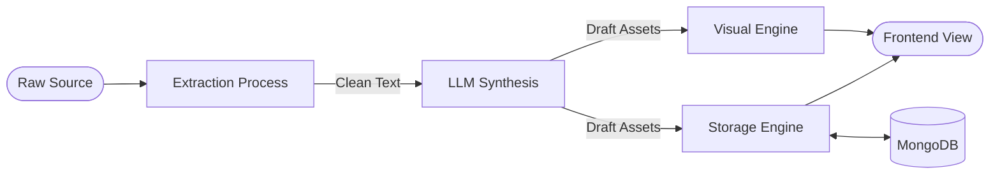

### 3.3 C4 System Context Diagram
High-level system abstraction.

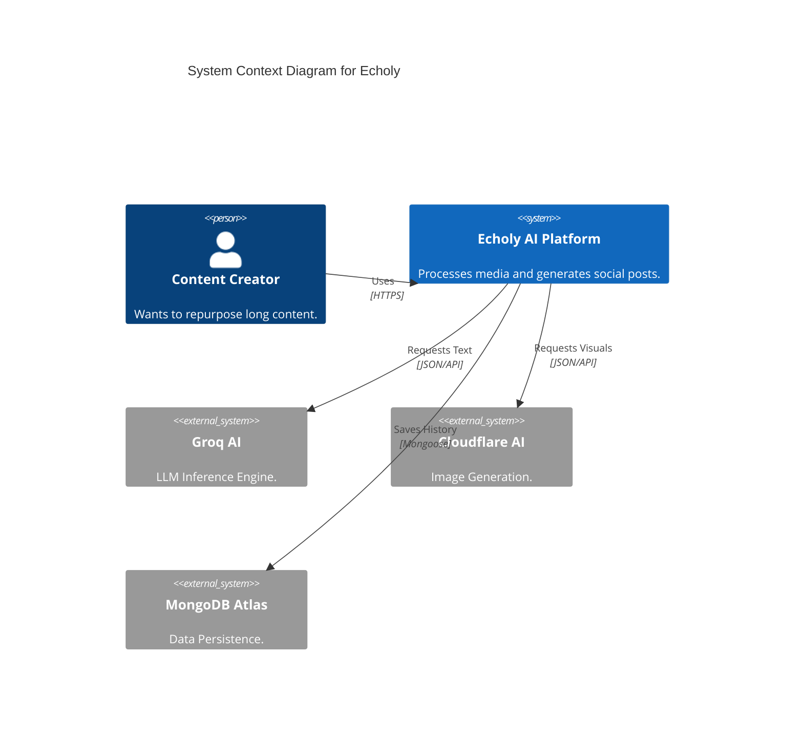

### 3.4 C4 Container Diagram
Technical containers in the system.

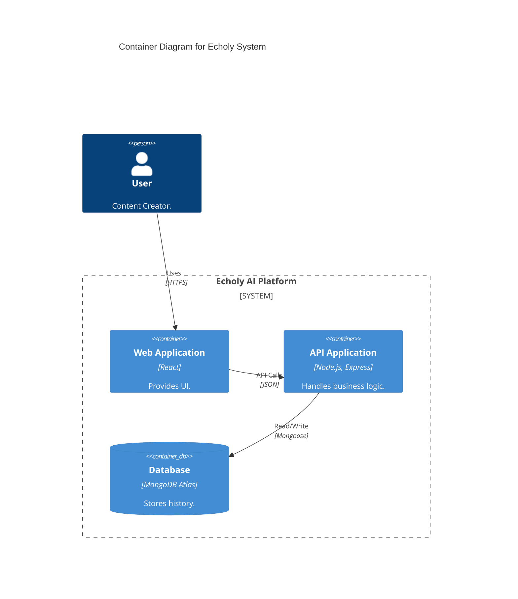

### 3.5 C4 Component Diagram
Components within the API container.

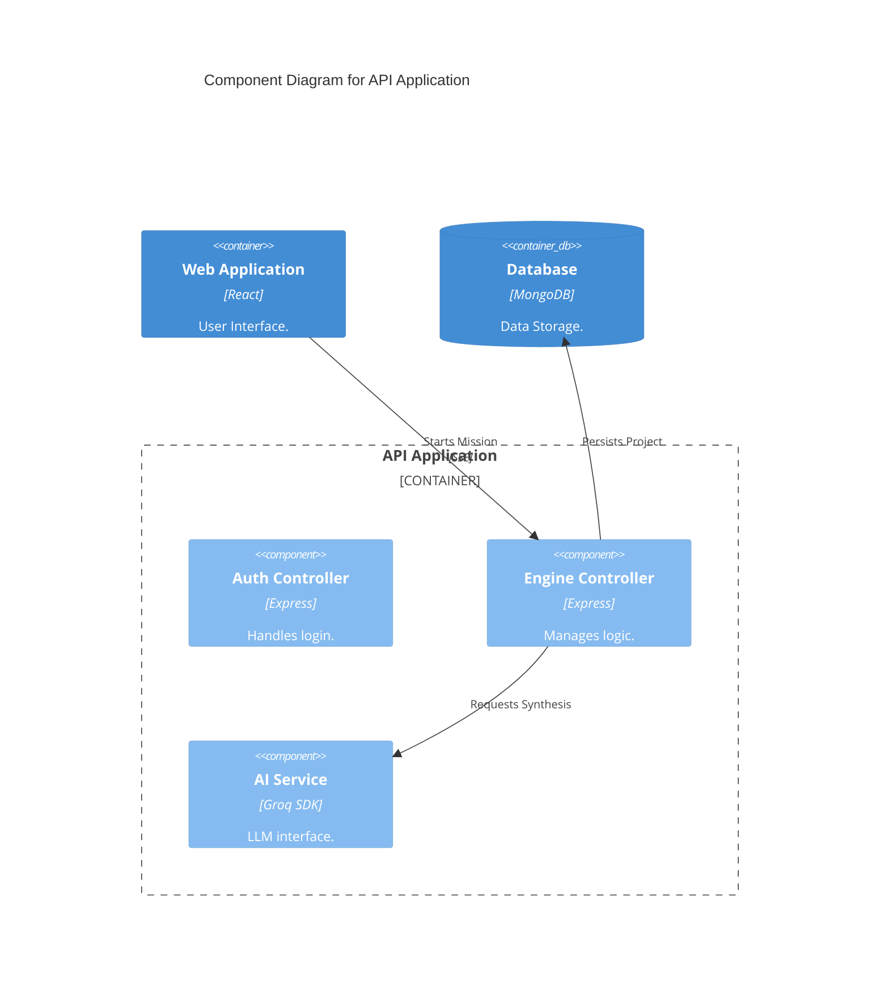

### 3.6 Flowchart: Generation Logic
Detailed conditional flow of the backend engine.

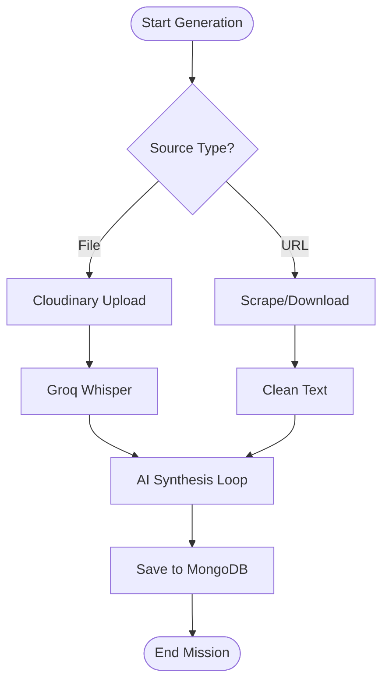

---
*Generated for Echoly v1.0 — Architecture Dossier*
