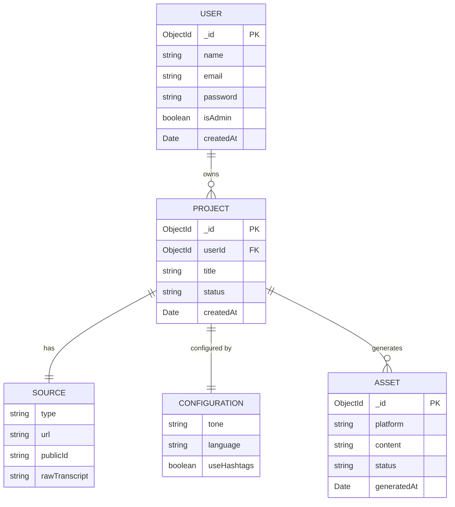
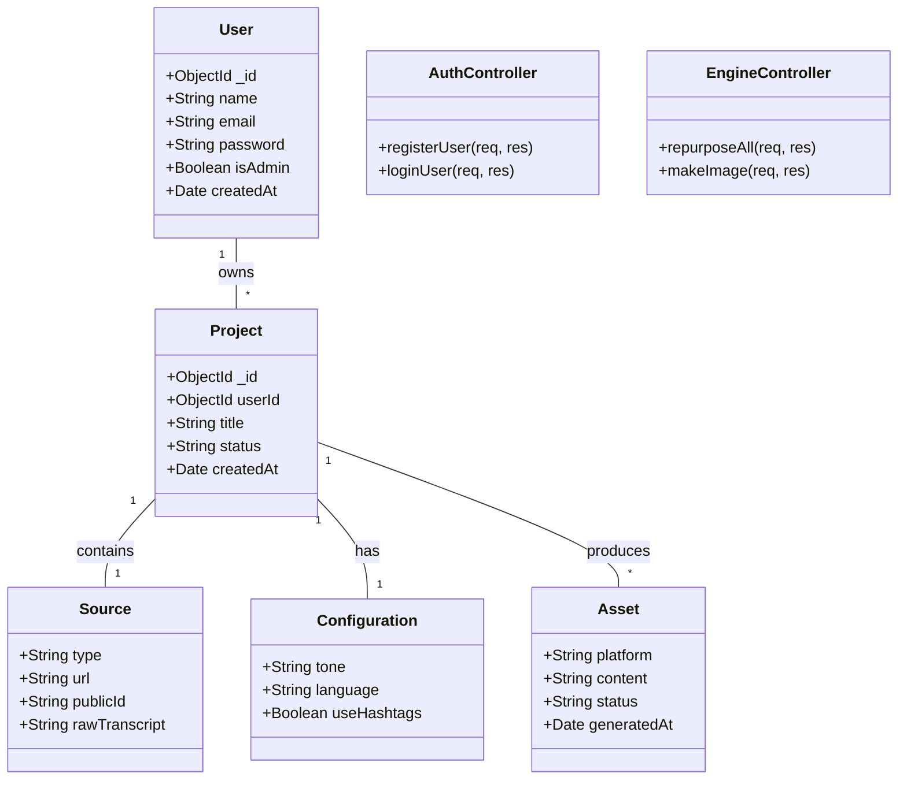
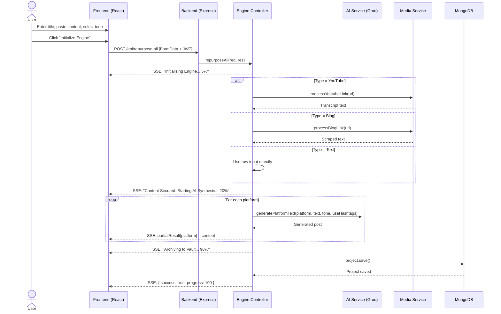
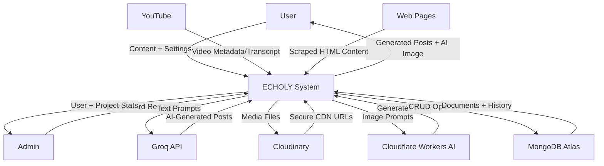
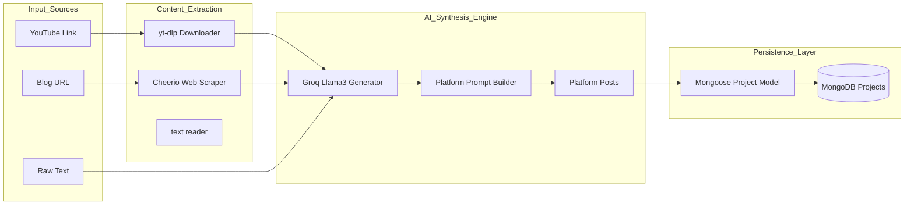
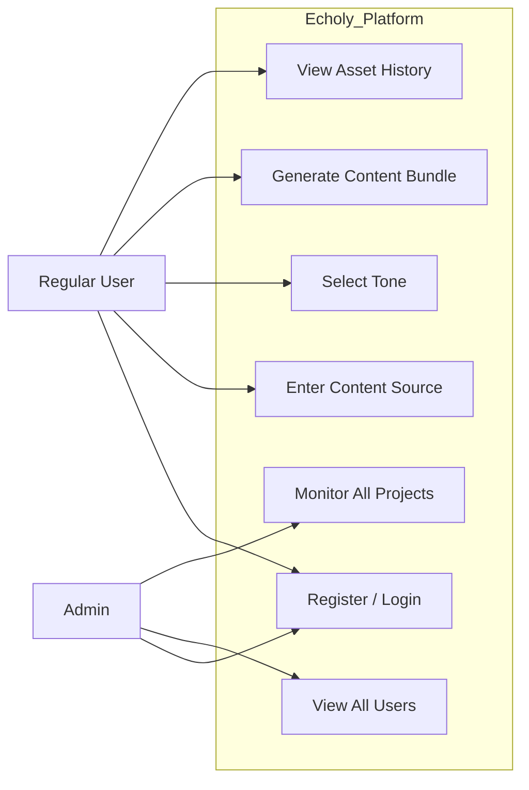
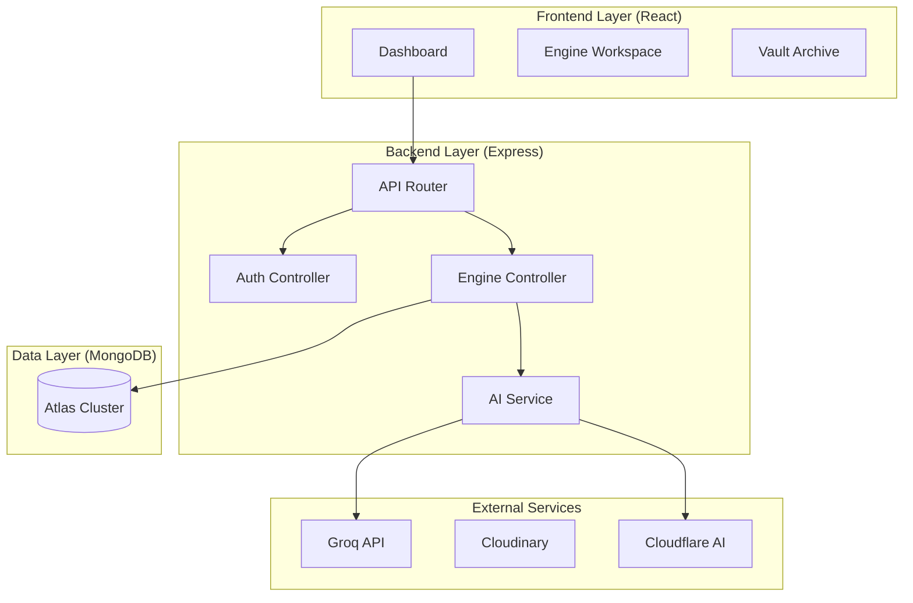

# Echoly — System Design Documentation

> All diagrams are rendered using Mermaid and are compatible with GitHub, Notion, and most modern markdown viewers.

---

## 1. Entity Relationship (ER) Diagram

Describes the database schema and relationships stored in MongoDB.

---

## 2. UML Class Diagram

Represents the relationship between backend models, services, controllers, and routes.

---

## 3. UML Sequence Diagram — Content Generation Flow

Illustrates the end-to-end interaction when a user generates content.

---

## 4. Data Flow Diagram (DFD) — Level 0 (Context Diagram)

Shows the top-level system interactions with external entities.

---

## 5. Data Flow Diagram (DFD) — Level 1 (System Internals)

Breaks down the internal processes within the Echoly backend.

---

## 6. UML Use Case Diagram

Describes the functional capabilities by user role.

---

## 7. System Architecture Diagram

Illustrates the deployment and layered architecture.

---

*Documentation updated for Echoly v1.0 — March 2026*
